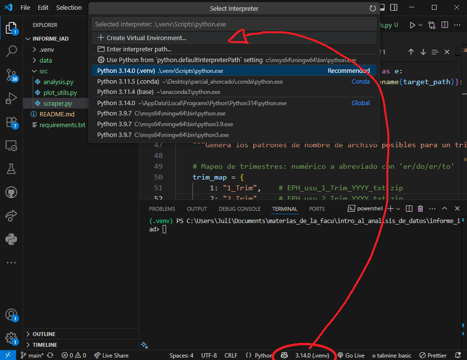

# informe_iad

Para inicializar el proyecto:

1. clonar el repositorio de manera local
2. descargar la ultima version de python
3. Crear un nuevo ambiente virtual dentro de vscode con .venv

4. activar el ambiente virtual ejecutando ```.venv\Scripts\activate``` en la consola de vscode
5. instalar las librerias requeridas ejecutando ```pip install -r requirements.txt``` en la consola de vscode
6. para correr el scraper y descargar los datos del indec ejectutar  ```python src/scraper.py``` en la consola de vscode
